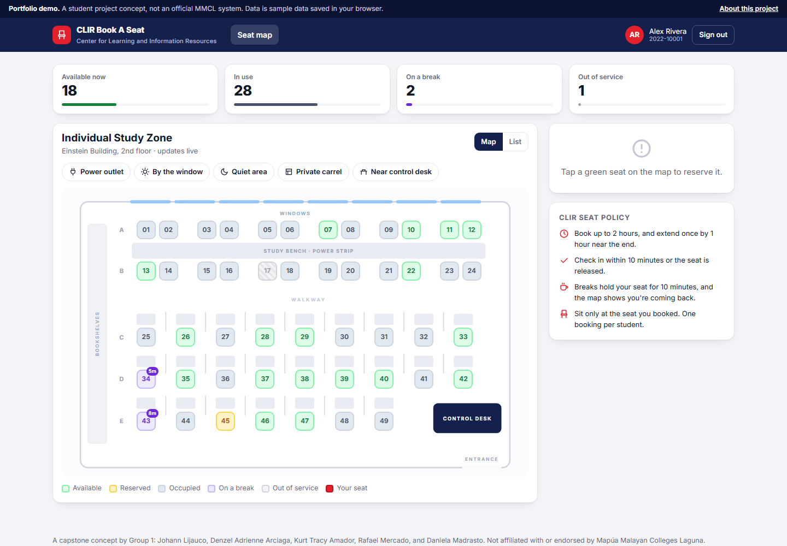
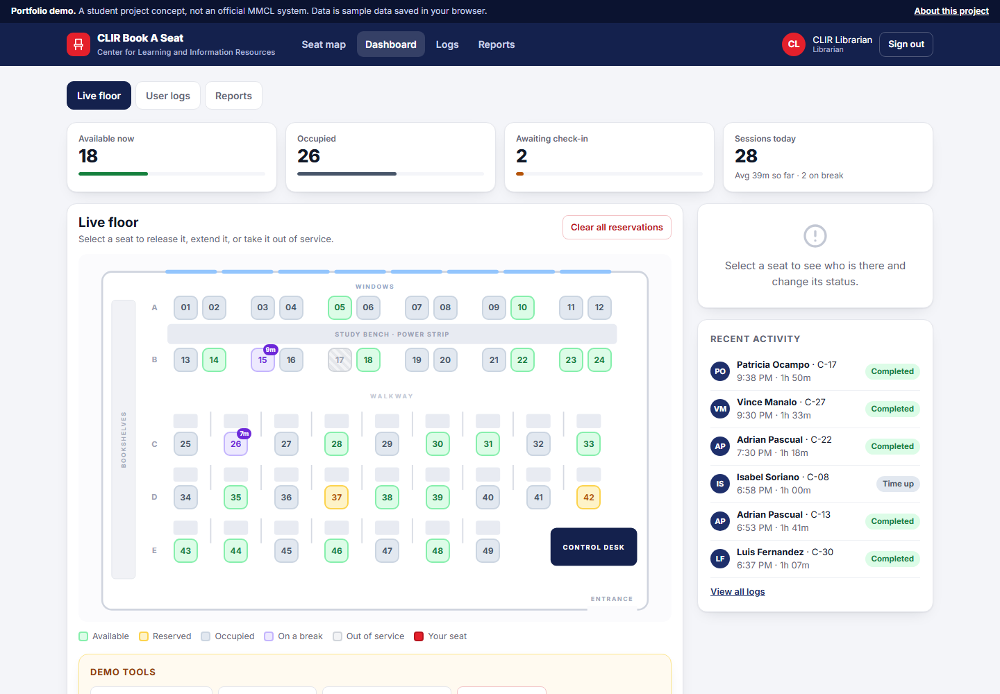
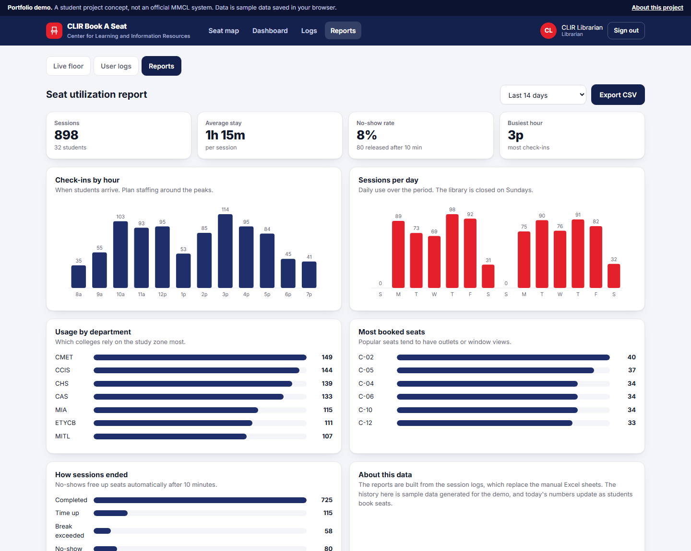

# CLIR Book A Seat

**A web-based seat booking system for the MMCL CLIR library.** Students see which seats are free on a live floor map and book one in two taps. Librarians manage seats, logs, and reports.

**Try it:** [as a student](https://yowhann321.github.io/MyPersonalWebsite/projects/clir-book-a-seat/?as=student) · [as a librarian](https://yowhann321.github.io/MyPersonalWebsite/projects/clir-book-a-seat/?as=librarian)

| Librarian dashboard | Utilization reports |
|---|---|
|  |  |

## The problem

CLIR, the library of Mapúa Malayan Colleges Laguna, ran its Book A Seat process on Microsoft Forms and Excel:

- Students filled out the same long form on every visit.
- Nobody could tell whether seats were free before walking over.
- Librarians had no way to edit seat status, view user logs, or clear reservations, and compiled term reports by hand.
- Under the 10-minute rule, students' belongings could be moved during short breaks even when their booking hadn't ended.

## What it does

**For students**
- **Live seat map** of the Individual Study Zone (Einstein Building, 2nd floor, seats C-01 to C-49) showing available, reserved, occupied, on-break, and out-of-service seats. The free-seat count is visible without signing in.
- **Two-tap booking:** create an account once, then just pick a seat and a duration.
- **Filter by need:** power outlet, window view, quiet area, private carrel, or near the control desk.
- **CLIR policies built in:** up to 2 hours with one 1-hour extension, a 10-minute check-in window that releases no-shows, and a visible 10-minute break timer that holds the seat.

**For librarians**
- **Live dashboard:** release or extend seats, mark seats out of service, and clear all reservations at closing time.
- **User logs** with search, filters, and CSV export.
- **Reports:** check-ins by hour, sessions per day, usage by department, most-booked seats, and how sessions ended.

## How it's built

- Plain JavaScript, HTML, and CSS with no frameworks or build step. Open `index.html` through any static server.
- State is stored in `localStorage` and syncs between tabs in real time; each tab keeps its own sign-in in `sessionStorage`. Open the student and librarian views side by side to watch bookings appear instantly.
- A simulation of students arriving, taking breaks, and leaving keeps the floor realistic. The librarian dashboard has demo tools to fast-forward time or trigger a rush hour.
- Passwords are hashed with SHA-256 before they're stored. (This is a front-end demo; a production version would authenticate against a server.)

Demo accounts: student `2022-10001` / `demo1234`, librarian `librarian` / `clir2025`.

## Background

This started as our Machine Problem for System Analysis and Design: a web-based seat booking system for MMCL CLIR, with requirements gathered from an interview with CLIR staff and a survey of 30 students. Our first build was an ASP.NET Web Forms prototype in C#. This version turns those static pages into a working system.

## Team

Group 1: **Johann Lijauco**, **Denzel Adrienne Arciaga**, **Kurt Tracy Amador**, **Rafael Mercado**, and **Daniela Madrasto**.

*A student project concept. It is not an official system of, or endorsed by, Mapúa Malayan Colleges Laguna. The demo uses sample data.*
